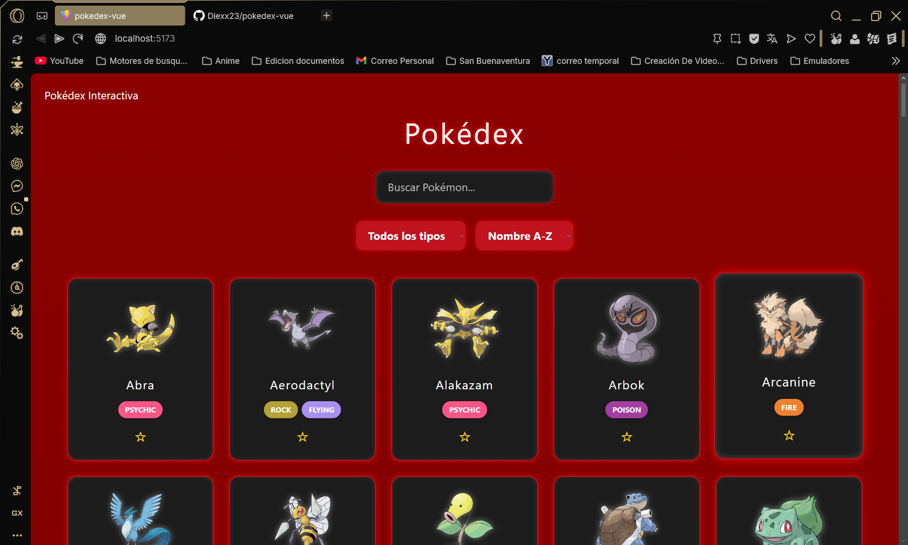
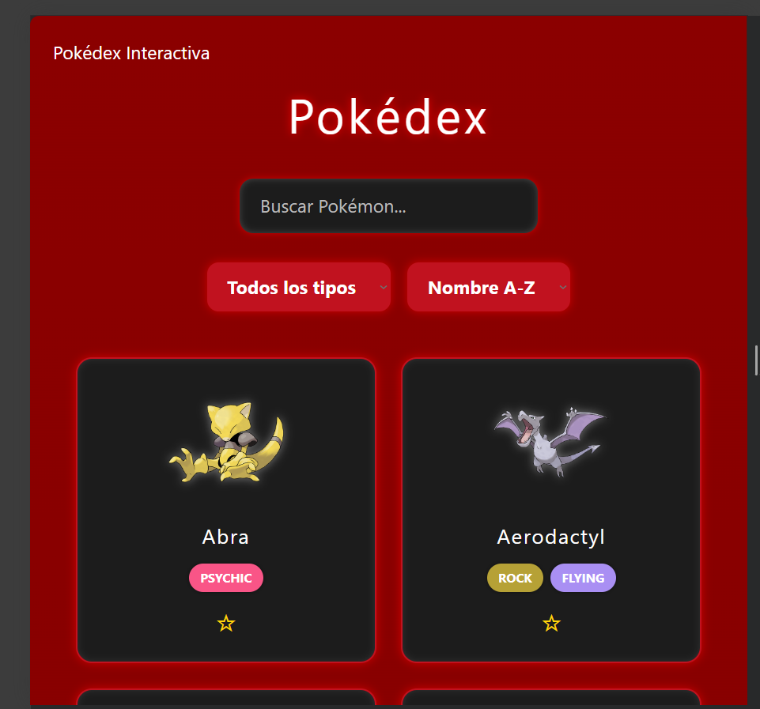
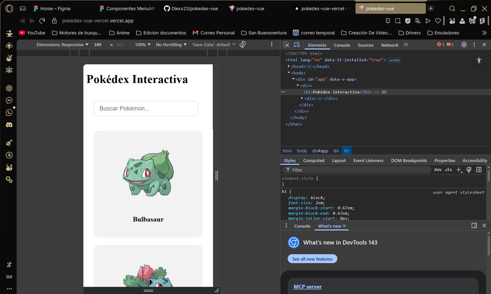

# 📘 Pokédex Interactiva

Aplicación web desarrollada con **Vue 3 + Vite** que consume la API pública de Pokémon para mostrar una Pokédex dinámica e interactiva.
El proyecto implementa **estado global, filtros dinámicos, búsqueda en tiempo real y persistencia de datos en el navegador**, mejorando la experiencia del usuario.

---

# 🚀 Características

* Consumo de API REST desde **PokeAPI**
* Visualización dinámica de **151 Pokémon**
* Buscador en tiempo real
* Filtros dinámicos por tipo de Pokémon
* Ordenamiento alfabético (A-Z / Z-A)
* Manejo de estado global con **Pinia**
* Sistema de **favoritos**
* Persistencia de favoritos usando **localStorage**
* Componentes reutilizables
* Navegación entre vistas con **Vue Router**
* Renderizado dinámico de listas con **v-for**
* Diseño responsive compatible con **PC, tablet y móvil**
* Estados de interfaz:

  * Loading
  * Mensajes de error
  * Estado vacío

---

# 🛠 Tecnologías utilizadas

* Vue 3
* Vite
* Pinia
* Vue Router
* JavaScript
* CSS Grid / Flexbox
* API REST

---

# 📸 Vista previa

## PC



## Tablet



## Móvil



---

# 📂 Estructura del proyecto

```
src/
│
├── components/
│   ├── PokemonCard.vue
│   ├── SearchBar.vue
│   └── FilterBar.vue
│
├── views/
│   ├── PokemonList.vue
│   └── DetailView.vue
│
├── stores/
│   └── pokemonStore.js
│
├── router/
│   └── index.js
│
├── App.vue
└── main.js
```

---

# ▶️ Instalación y ejecución

Clonar el repositorio

```
git clone https://github.com/Diexx23/pokedex-vue.git
```

Entrar al proyecto

```
cd pokedex-vue
```

Instalar dependencias

```
npm install
```

Ejecutar en modo desarrollo

```
npm run dev
```

Abrir en el navegador

```
http://localhost:5173
```

---

# 🌐 Demo en vivo

La aplicación está desplegada y accesible online en **Vercel**

https://pokedex-vue-vercel.vercel.app

---

# 📊 Funcionalidades implementadas

| Funcionalidad             | Implementación                      |
| ------------------------- | ----------------------------------- |
| Estado global             | Pinia                               |
| Búsqueda dinámica         | v-model + computed                  |
| Filtros                   | Tipos dinámicos desde API           |
| Ordenamiento              | Computed                            |
| Persistencia              | localStorage                        |
| Componentes reutilizables | SearchBar / FilterBar / PokemonCard |
| UX mejorada               | Loading y estados vacíos            |
| Responsive                | CSS Grid                            |

---

# 👨‍💻 Autor

Proyecto desarrollado por **Diego Vásquez**
Estudiante de Ingeniería Multimedia